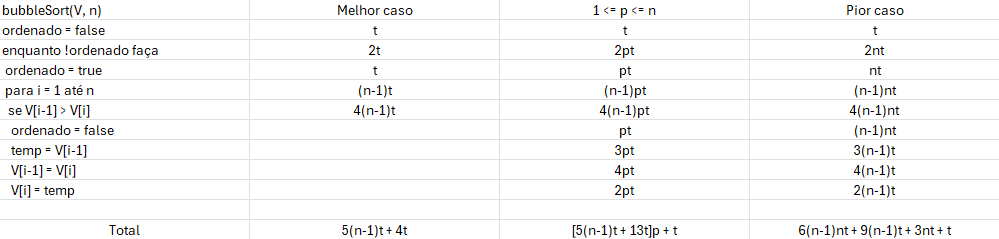
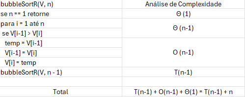
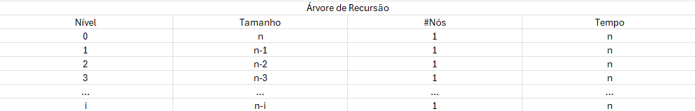

# BubbleSort Iterativo
```
bubbleSort(V, n)
ordenado = false
enquanto !ordenado faça
 ordenado = true
 para i = 1 até n
  se V[i-1] > V[i]
   ordenado = false
   temp = V[i-1]
   V[i-1] = V[i]
   V[i] = temp
  Fim se
 Fim para
Fim enquanto
Fim bubbleSort
```

<p align="center">
  <!--  -->
  
</p>

## Melhor caso: $\Omega$ $5(n-1)t + 4t$ = $\Omega$ $5(n-1) + 4$ = $\Omega$ $5n - 1$

## $1 <= p <= n: [5(n-1)t + 13t]p + t = 5(n-1)p + 13p + 1$

## Pior caso: O $6(n-1)nt + 9(n-1)t + 3nt + t = 6(n-1)n + 9(n-1) + 3n + 1 = 6n^2 - 6n + 9n - 9 + 3n + 1 = 6n^2 + 6n - 8$

### A função é O ($n$)? 
 $$\lim_{n \to \infty} \dfrac{6n^2 + 6n - 8}{n} = \lim_{n\to\infty} 12n + 6 \to \infty$$

 Logo, a função não é O ($n$).
### A função é O (n^2)?
 $$\lim_{n\to\infty} \dfrac{6n^2 + 6n - 8}{n^2} = \lim_{n\to\infty} \dfrac{12n + 6}{n} = \lim_{n\to\infty} 12 = 0$$

 Logo, a função é O ($n^2$).

### A função é Ω (n^2)?
 $$\lim_{n\to\infty} \dfrac{5n - 1}{n^2} = \lim_{n\to\infty} \dfrac{5}{n} \to 0$$
 
 Logo, a função não é Ω ($n^2$).
### A função é Ω (n)?
 $$\lim_{n\to\infty} \dfrac{5n - 1}{n} = \lim_{n\to\infty} 5 = 5$$
 
 Logo, a função é Ω ($n$).

## Como a função é O ($n^2$) e $\Omega$ ($n$), então a função não apresenta comportamento $Θ$.

# BubbleSort Recursivo
```
bubbleSortR(V, n)
se n == 1 retorne
para i = 1 até n
 se V[i-1] > V[i]
   temp = V[i-1]
   V[i-1] = V[i]
   V[i] = temp
  Fim se
Fim para
bubbleSortR(V, n - 1)
Fim bubbleSortR
```

<p align="center">
  <!--  -->
  
</p>

$$
T(n) 
\begin{cases}
  \Theta 1 & \text{if } x = 1 \\
  T(n-1) + n  & \text{if } x \gt 1
\end{cases}
$$

## Resolvendo a recorrência
## Método da Substituição
Vamos mostrar por indução que $T(n) \leq cn^2$, $\forall c, n \gt 0$, aplicando indução em $n$.

### Caso base: $n = 1$.
Temos da definição que $T(1) = 1$. Disso

$$
\begin{align*}
  T(1) = 1 &\leq  c(1^2) &\implies c \geq 1
\end{align*}
$$

### Hipótese de Indução: 

Suponha que para um $k$ arbitrário, tal que $1 \lt k \leq n$, vale que

$$ T(k) <= ck^2 $$

Observe que $n-1 < n$, $\forall n > 1$.

#### Assim,
$$
\begin{align*}
  T(n) & \leq T(n-1) + n &\leq c(n-1)^2 + n &\leq cn^2 \\
   & & cn^2 - 2cn + c + n &\leq cn^2\\
  %  & & c &\leq 2cn - n \\
  %  & & c &\leq n(2c - 1)
\end{align*}
$$

Logo, precisamos apenas garantir que a expressão $-2cn + c + n \leq 0$ para que a igualdade seja verdade. 

Podemos reorganizar a expressão para

$$
\begin{align*}
  c(-2n + 1) + n &\leq 0 \\
  c(-2n + 1) &\leq -n \\
  c &\geq \dfrac{-n}{-2n+1} \\
  c &\geq \dfrac{n}{2n+1} \\
\end{align*}
$$

Como temos que $n > 1$, então basta que $c \geq 1$. Podemos dizer então que $c = 2$.

Logo, $T(n)$ é O($n^2$)

## Método da Iteração
$$ T(n) \leq T(n-1) + n $$

Expandindo isso, temos

$$
\begin{align*}
i=1 & & & T(n) \leq  T(n-1) + n \\
i=2 & & & [T(n-2) + n] + n \\
i=3 & & & [[T(n-3) + n] + n] + n \\
... & & & \\
i   & & & T(n-i) + in
\end{align*}
$$

Sabemos que $T(1) = 1$.

$$
\begin{align*}
n - i = 1 \implies i = n - 1
\end{align*}
$$

Substituindo isso na fórmula geral que descobrimos acima:

$$
\begin{align*}
&= T(n-(n-1)) + (n-1)n  \\
&= T(n-n+1) + n^2 - n \\
&= 1 + n^2 - n \\
&= n^2 - n + 1 \\
&= n^2 \\
\end{align*}
$$

Logo, $T(n)$ é O($n^2$)

## Árvore de Recursão
<p align="center">
  <!--  -->
  
</p>

Sabemos que $T(1) = 1$. Assim,

$n-i = 1 \implies i = n-1$

Substituindo na fórmula,

$$
\begin{align*}
 \sum_{i=0}^{n-1} (n \cdot 1) &= n \cdot n \\
 &= n^2
\end{align*}
$$

Logo, $T(n)$ é O $(n^2)$

## Teorema Meste
Como nossa recorrência não é da forma:

$$T(n) = aT \left( \dfrac{n}{b} \right) + \Theta(n^K)$$

Temos que o Teorema Mestre não é aplicável.
