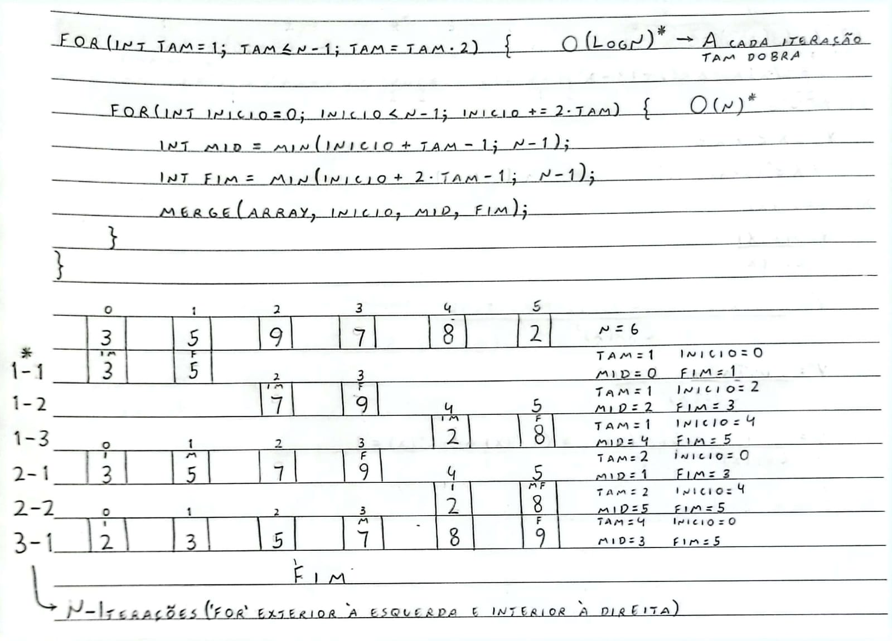
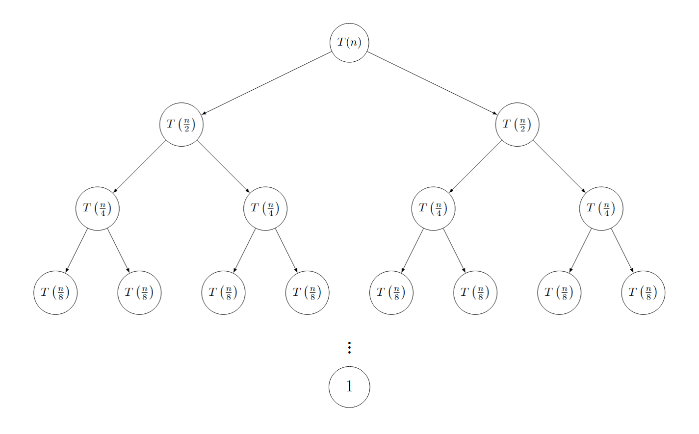

# Pseudocódigos

## Comportamento do merge sort

Aqui está um exemplo de como o merge sort se comporta. Ele utiliza uma estratégia de dividir para conquistar, na qual ele divide o vetor a ser ordenado em subvetores com metade do tamanho até não conseguir dividir mais. Quando isso acontece ele começa a juntar os subvetores ordenando eles até reconstruir o vetor original de forma ordenada.


## Merge sort recursivo
```
Função MergeSortRecursivo(array, inicio, fim)
	
    Se inicio < fim Então:
        meio ← (inicio + fim) / 2
        MergeSortRecursivo(array, inicio, meio)
        MergeSortRecursivo(array, meio + 1, fim)
        Merge(array, inicio, meio, fim)
    FimSe
	
FimFunção
```
## Merge sort iterativo
```
Algoritmo MergeSortIterativo(array, n)
    tam_atual ← 1
    
    Enquanto tam_atual <= n - 1 Faça:
        inicio ← 0
		
        Enquanto inicio < n - 1 Faça:
            meio ← mínimo(inicio + tam_atual - 1, n - 1)
            
            fim ← mínimo(inicio + 2 * tam_atual - 1, n - 1)
            
            Merge(array, inicio, meio, fim)
            
            inicio ← inicio + 2 * tam_atual
        FimEnquanto
		
        tam_atual ← 2 * tam_atual
    FimEnquanto
FimAlgoritmo
```
## Função merge
```
Função Merge(array, inicio, meio, fim)
    i ← inicio
    j ← meio + 1
    k ← inicio
    aux ← novo vetor com tamanho de array
	
    Enquanto i <= meio E j <= fim Faça:
        Se array[i] < array[j] Então
            aux[k] ← array[i]
            i ← i + 1
        Senão:
            aux[k] ← array[j]
            j ← j + 1
        FimSe
        k ← k + 1
    FimEnquanto
	
    Enquanto i <= meio Faça:
        aux[k] ← array[i]
        i ← i + 1
        k ← k + 1
    FimEnquanto
	
    Enquanto j <= fim Faça:
        aux[k] ← array[j]
        j ← j + 1
        k ← k + 1
    FimEnquanto
	
    Para p de inicio até fim Faça:
        array[p] ← aux[p]
    FimPara
FimAlgoritmo
```

---

# Análise de complexidade
## Função merge
```C++
void merge(int n, int *arr, int inicio, int meio, int fim) {
    int i = inicio, j = meio + 1, k = inicio; 
    int aux[n];

    while (i <= meio && j <= fim) {
        if (arr[i] < arr[j]) {
            aux[k] = arr[i];
            i++;
        }
        else {
            aux[k] = arr[j];
            j++;
        }
        k++;
    }
    while (i <= meio) {
        aux[k] = arr[i];
        i++;
        k++;
    }
    while (j <= fim) {
        aux[k] = arr[j];
        j++;
        k++;
    }
    for (int p = inicio; p <= fim; p++) {
        arr[p] = aux[p];
    }
}
```

<table border="1">
  <tr  style="background-color: black;">
    <th>Linha de Código</th>
    <th>Pior caso</th>
    <th>Melhor caso</th>
  </tr>
  <tr>
    <td>int i = inicio, j = meio + 1, k = inicio;</td>
    <td>4t</td>
    <td>4t</td>
  </tr>
  <tr>
    <td>int aux[n];</td>
    <td>1t</td>
    <td>1t</td>
  </tr>
  <tr>
    <td>while (i <= meio && j <= fim) {</td>
    <td>2tn</td>
    <td>2tn</td>
  </tr>
  <tr>
    <td>&nbsp;&nbsp;&nbsp;&nbsp;if (arr[i] &lt; arr[j]) {</td>
    <td>3t(n-1)</td>
    <td>3t(n-1)</td>
  </tr>
  <tr>
    <td>&nbsp;&nbsp;&nbsp;&nbsp;&nbsp;&nbsp;&nbsp;&nbsp;aux[k] = arr[i];</td>
    <td>--------</td>
    <td>3t(n-1)</td>
  </tr>
  <tr>
    <td>&nbsp;&nbsp;&nbsp;&nbsp;&nbsp;&nbsp;&nbsp;&nbsp;i++;</td>
    <td>--------</td>
    <td>1t(n-1)</td>
  </tr>
  <tr>
    <td>&nbsp;&nbsp;&nbsp;&nbsp;} else {</td>
    <td>--------</td>
    <td>--------</td>
  </tr>
  <tr>
    <td>&nbsp;&nbsp;&nbsp;&nbsp;&nbsp;&nbsp;&nbsp;&nbsp;aux[k] = arr[j];</td>
    <td>3t(n-1)</td>
    <td>--------</td>
  </tr>
  <tr>
    <td>&nbsp;&nbsp;&nbsp;&nbsp;&nbsp;&nbsp;&nbsp;&nbsp;j++;</td>
    <td>1t(n-1)</td>
    <td>--------</td>
  </tr>
  <tr>
    <td>&nbsp;&nbsp;&nbsp;&nbsp;k++;</td>
    <td>1t(n-1)</td>
    <td>1t(n-1)</td>
  </tr>
  <tr>
    <td>while (i <= meio) {</td>
    <td>1tn</td>
    <td>1tn</td>
  </tr>
  <tr>
    <td>&nbsp;&nbsp;&nbsp;&nbsp;aux[k] = arr[i];</td>
    <td>3t(n-1)</td>
    <td>3t(n-1)</td>
  </tr>
  <tr>
    <td>&nbsp;&nbsp;&nbsp;&nbsp;i++;</td>
    <td>1t(n-1)</td>
    <td>1t(n-1)</td>
  </tr>
  <tr>
    <td>&nbsp;&nbsp;&nbsp;&nbsp;k++;</td>
    <td>1t(n-1)</td>
    <td>1t(n-1)</td>
  </tr>
  <tr>
    <td>while (j <= fim) {</td>
    <td>1tn</td>
    <td>1tn</td>
  </tr>
  <tr>
    <td>&nbsp;&nbsp;&nbsp;&nbsp;aux[k] = arr[j];</td>
    <td>3t(n-1)</td>
    <td>3t(n-1)</td>
  </tr>
  <tr>
    <td>&nbsp;&nbsp;&nbsp;&nbsp;j++;</td>
    <td>1t(n-1)</td>
    <td>1t(n-1)</td>
  </tr>
  <tr>
    <td>&nbsp;&nbsp;&nbsp;&nbsp;k++;</td>
    <td>1t(n-1)</td>
    <td>1t(n-1)</td>
  </tr>
  <tr>
    <td>for (int p = inicio; p <= fim; p++) {</td>
    <td>3tn</td>
    <td>3tn</td>
  </tr>
  <tr>
    <td>&nbsp;&nbsp;&nbsp;&nbsp;arr[p] = aux[p];</td>
    <td>3t(n-1)</td>
    <td>3t(n-1)</td>
  </tr>
</table>

##### Pior caso:

$$
5t + 7tn + 21t(n-1)
$$
$$
5t + 7tn + 21tn - 21t
$$
$$
28t\underline{n} - 16t \implies O(n)
$$

##### Melhor caso:

$$
5t + 7tn + 21t(n-1)
$$
$$
5t + 7tn + 21tn - 21t
$$
$$
28t\underline{n} - 16t \implies \Omega(n)
$$

Para o _melhor_ e _pior_ caso do algoritmo merge temos Ω(n) e O(n), logo essa função é Θ(n). 
## Iterativo
```C++
// Complexidade | quantas vezes vai rodar
// Essa função simples retorna o menor parâmetro
int min(int x, int y) { return (x < y)? x :y; } // Θ(1) | 1

void mergeSortI(int n, int *arr) {
    int tam_atual; // Θ(1) | 1
    int inicio;    // Θ(1) | 1
    for (tam_atual = 1; tam_atual <= n-1; tam_atual = 2 * tam_atual) { // log(n)
        for (inicio = 0; inicio < n-1; inicio += 2 * tam_atual) { // n
            int meio = min(inicio + tam_atual - 1, n-1);    // Θ(1) | nlog(n)
            int fim = min(inicio + 2 * tam_atual - 1, n-1); // Θ(1) | nlog(n)
            merge(n, arr, inicio, meio, fim);               // Θ(n) | nlog(n)
        }
    }
}
```

Observe que o ``tam_atual`` em ``for (tam_atual = 1; tam_atual <= n-1; tam_atual = 2 * tam_atual)`` dobra de valor a cada iteração, e consequentemente o problema é dividido pela metade. Com esse comportamento a cada chamada da função esse bloco de código irá ser executada _log(n)_ vezes. Como temos 2 _for_ aninhados, o exterior com complexidade _log(n)_ e o interior _n_, temos que nossa complexidade total é _n log(n)_. Abaixo deixei uma imagem para ilustrar melhor como cada iteração do algoritmo funciona:



Outro fato importante para se observar é que o pior e o melhor caso serão _iguais_ pois não importa se o vetor está ordenado ou desordenado, o algoritmo sempre executará os mesmas instruções para iterar sobre tal vetor. Logo podemos afirmar que a complexidade é _Θ(n log(n))_.
## Recursivo
```C++
void mergeSortR(int n, int *arr, int inicio, int fim) {
    if (inicio < fim) {                                // Θ(1)
        int meio = (inicio + fim) / 2;                 // Θ(1)
        mergeSortR(n, arr, inicio, meio);              // T(n/2)
        mergeSortR(n, arr, meio + 1, fim);             // T(n/2)
        merge(n, arr, inicio, meio, fim);              // Θ(n)
    }
}
```

Isso ocorre pois a cada chamada recursiva o problema é dividido pela metade até que não seja mais possível dividi-lo em partes menores. Esse comportamento nos dá a seguinte relação de recorrência:
### Relação de recorrência (RR)

$$
T(n) = \Theta(1) + T\left( \frac{n}{2} \right) + T\left( \frac{n}{2} \right) + \Theta(n)
$$
$$
T(n) = 2T\left( \frac{n}{2} \right) + \Theta(n) + \cancel{\Theta(1)}
$$
$$
T(n) = 2T\left( \frac{n}{2} \right) + \Theta(n)
$$
Assim chegamos na seguinte recorrência:
$$
T(n) 
\begin{cases}
  \Theta (1) & \text{if } n = 1 \\
  2T\left( \frac{n}{2}\right) + \Theta(n)  & \text{if } n \gt 1
\end{cases}
$$

Com essa fórmula de recorrência em mente, podemos resolve-la por meio dos 4 métodos estudados.
### Método da substituição
#### T(n) é limitado por n log(n)?
##### Hipótese indutiva (HI):

$$
T(k)\leq c\times k\log k, \forall k \in \mathbb{N},\ tal\ que\ k>1 
$$

##### Passo indutivo:

$$
T(n) = 2T\left( \frac{n}{2} \right) + \Theta(n)
$$
$$
T(n) = 2\left( c\times \frac{n}{2}\log \frac{n}{2} \right) + n,\ pela\ (HI)
$$
$$
T(n) = c\times n\log \frac{n}{2} + n
$$
$$
T(n) = cn\times(\log n - \cancel{\log 2}^{1}) + n
$$
$$
T(n) = c\times n\log n- \cancel{cn + n}
$$
$$
T(n) \leq c\times n\log n\,\ mantendo\ os\ termos\ de\ maior\ ordem
$$
$$
\therefore\ T(n)\ é\ O(n\log n)
$$

#### T(n) é limitado por n?
##### Hipótese indutiva (HI):

$$
T(k) \leq c\times n, \forall k \in \mathbb{N},\ tal\ que\ k>1
$$

##### Passo indutivo:

$$
T(n) = 2T\left( \frac{n}{2} \right) + \Theta(n)
$$
$$
T(n) = 2\left(c\times \frac{n}{2} \right) + n,\ pela\ (HI)
$$
$$
T(n) = \frac{\cancel2cn}{\cancel2} + n
$$
$$
T(n) = cn + n
$$
$$
T(n) \leq cn+n \neq T(n) \leq cn 
$$
$$
\therefore\ T(n)\ não\ é\ limitado\ por\ n
$$

Assim provamos que o algoritmo merge sort é $O(n\log n)$.
### Método da iteração 
`i: número de iterações`
`i=1`

$$
T(n) = 2T\left( \frac{n}{2} \right) + n
$$

`i=2`

$$
T(n) = 2T\left( 2T\left( \frac{n}{4} \right) + \frac{cn}{2} \right) + n
$$
$$
T(n) = 4T\left( \frac{n}{4} \right) + 2n
$$

`i=3`

$$
T(n) = 4\left( 2T\left( \frac{n}{8} \right) + \frac{cn}{4}\right) + 2n
$$
$$
T(n) = 8T\left( \frac{n}{8} \right) + 3n
$$
$$
\dots
$$

`i=k`

$$
T(n) = 2^kT\left( \frac{n}{2^k} \right) + kn
$$

A condição de parada do algoritmo ocorre quando $\frac{n}{2^k}=1$.
Logo temos:

$$
\frac{n}{2^k}=1
$$
$$
2^k=n
$$
$$
k=\log_{2}n
$$

Substituindo na fórmula temos:

$$
T(n) = 2^{\log_{2}n}T\left( \cancel{\frac{n}{2^{\log_{2}n}}}^1 \right)+\log_{2}n\times n
$$
$$
T(n) = n\times T(1) + n\log_{2}n,\ visto\ que\ 2^{\log_{2}n}=n
$$
$$
T(n) = n\times \Theta(1) + n\log_{2}n,\ pela\ (RR)
$$
$$
T(n) = n\log n,\ mantendo\ os\ termos\ de\ maior\ ordem
$$
$$
\therefore T(n)\ é\ O(n\log n)
$$

### Árvore de recursão


$$
\frac{n}{2^i} = 1 \implies n = 2^i \implies  \underline{i=\log_{2}n}
$$
##### Somatório:
$$
\sum_{i=0}^{\log_{2}n} \frac{n}{2^i}\times 2^i = \sum_{i=0}^{\log_{2}n} n 
$$
$$
= n(\log_{2}n + 1) = n\log_{2}n + \cancel{n} = n\log_{2}n
$$
$$\therefore T(n)\ é\ O(n\log n)$$
### Método mestre:

> Regras do método mestre
> $$T(n) = aT\left( \frac{n}{b} \right) + \Theta(n^k)$$
> 1. Se $a>b^k$, então T(n) é $\Theta(n^{\log_{b}a})$
> 2. Se $a=n^k$, então T(n) é  $\Theta(n^k\log n)$
> 3. Se $a<b^k$, então T(n) é $\Theta(n^k)$

Com o merge sort nós temos o seguinte:

$$
T(n) = 2T\left( \frac{n}{2} \right) + \Theta(n)
\begin{cases}
  a=2 \\
  b=2 \\
  k=1
\end{cases}
$$

Como $2=2^1$, T(n) é $\Theta(n\log n)$.
